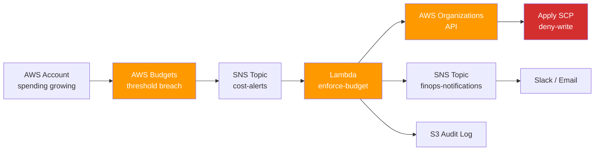

# 01 — FinOps Budget Enforcement with SCP

> Automated cost guardrails for AWS multi-account environments. Blocks an account automatically when it crosses a configured budget threshold, using **AWS Budgets + SNS + Lambda + Service Control Policies (SCP)**.

[](https://aws.amazon.com)
[](https://python.org)
[](https://terraform.io)
[](LICENSE)

---

## 🎯 The Problem

In AWS multi-account environments, a single misconfigured service or compromised credential can burn through a monthly budget in **hours**. Manual monitoring doesn't scale: by the time the bill arrives, the damage is done.

Common scenarios that this solves:
- Forgotten test environments running expensive resources (GPU EC2, large RDS)
- Compromised IAM keys spinning up crypto miners
- Runaway Lambda loops costing thousands overnight
- PoC accounts with no cost ownership

**Why existing solutions aren't enough:** AWS Budgets sends an email/SNS alert — but it requires a human to act. By the time someone reads the email, the spend has continued.

---

## 💡 The Solution

A closed-loop automation: when an account crosses its threshold, an SCP is automatically applied that denies **all non-essential actions** — effectively freezing the account until a human reviews and approves un-freezing.

**Flow:**
1. `AWS Budgets` watches each member account
2. On threshold breach → publishes to `SNS`
3. `Lambda` consumes the SNS event
4. `Lambda` calls `AWS Organizations API` to attach the `Deny-All-Except-Read` SCP to the offending account
5. A notification goes to FinOps + account owner via SNS / Slack
6. An audit entry is written to S3

The blocked account can only do read-only operations. Compute, network, storage writes — all denied.

---

## 🏗️ Architecture



---

## ⚙️ Stack

| Layer | Service |
|-------|---------|
| Cost monitoring | AWS Budgets |
| Event bus | Amazon SNS |
| Orchestration | AWS Lambda (Python 3.11) |
| Policy enforcement | AWS Organizations + Service Control Policies (SCP) |
| Audit | Amazon S3 |
| IaC | Terraform |
| Notifications | SNS → Email / Slack webhook |

---

## 📂 Repo Layout

```
01-finops-budget-enforcement/
├── README.md
├── terraform/
│   ├── main.tf              # Root module: budget + SNS + Lambda + SCP
│   ├── variables.tf
│   ├── outputs.tf
│   ├── modules/
│   │   ├── budget/          # AWS Budget definitions per account
│   │   ├── lambda/          # Lambda function + IAM
│   │   └── scp/             # SCP policy + Organizations attachment
│   └── policies/
│       └── deny-all-except-read.json
├── lambda/
│   ├── handler.py           # Main entrypoint
│   ├── organizations.py     # AWS Organizations client
│   ├── audit.py             # S3 audit writer
│   └── requirements.txt
└── docs/
    └── architecture.png
```

---

## 💻 Implementation Highlights

### Lambda handler (excerpt)

```python
import json
import boto3
from organizations import attach_scp
from audit import log_event

orgs = boto3.client("organizations")

def lambda_handler(event, context):
    """
    Triggered by AWS Budgets via SNS when an account
    crosses its configured threshold.
    """
    message = json.loads(event["Records"][0]["Sns"]["Message"])
    account_id = message["accountId"]
    budget_name = message["budgetName"]
    actual_amount = message["actualAmount"]

    # Apply the SCP that freezes write operations
    attach_scp(account_id, scp_id="p-denywrite")

    # Audit trail
    log_event(account_id, budget_name, actual_amount, action="frozen")

    # Notify FinOps
    return {"statusCode": 200, "account_frozen": account_id}
```

### SCP policy (excerpt)

```json
{
  "Version": "2012-10-17",
  "Statement": [
    {
      "Sid": "DenyAllWritesWhenBudgetExceeded",
      "Effect": "Deny",
      "Action": [
        "ec2:RunInstances",
        "ec2:StartInstances",
        "rds:CreateDBInstance",
        "lambda:InvokeFunction",
        "s3:PutObject"
      ],
      "Resource": "*"
    }
  ]
}
```

### Terraform (excerpt)

```hcl
module "budget" {
  source       = "./modules/budget"
  account_id   = var.account_id
  budget_limit = 500   # USD
  threshold    = 100   # percentage
  sns_topic    = module.sns.topic_arn
}

module "lambda_enforcer" {
  source        = "./modules/lambda"
  function_name = "enforce-budget"
  handler       = "handler.lambda_handler"
  sns_source    = module.sns.topic_arn
  scp_id        = aws_organizations_policy.deny_write.id
}
```

---

## ✅ Results

- ⏱️ **Time-to-block:** seconds from threshold breach to SCP applied (vs. hours of human delay)
- 💰 **Cost incidents avoided:** runaway-spend scenarios blocked before becoming material
- 🔒 **Governance:** every freeze is auditable in S3 with timestamp + cause
- 🔁 **Reversible:** un-freeze requires FinOps approval flow (separate Lambda + manual trigger)
- 📈 **Scales to N accounts:** same Terraform module deploys to every member account

---

## 🚀 How to Deploy

```bash
cd terraform/
terraform init
terraform plan -var-file=accounts.tfvars
terraform apply -var-file=accounts.tfvars
```

Requirements:
- AWS Organizations enabled (management account)
- Terraform 1.5+
- IAM permissions to manage SCPs and create Lambdas in the management account

---

## 📚 Related

- [02 — Cost Report Automation](../02-cost-report-automation) — feeds visibility into the same FinOps loop
- [04 — Terraform PoC Factory](../04-terraform-poc-factory) — bakes this enforcement into every new account from day 1

---

**Author:** Felipe de Lima Rosa · [LinkedIn](https://www.linkedin.com/in/felipe-limarosa) · [GitHub](https://github.com/felipefefeu)
