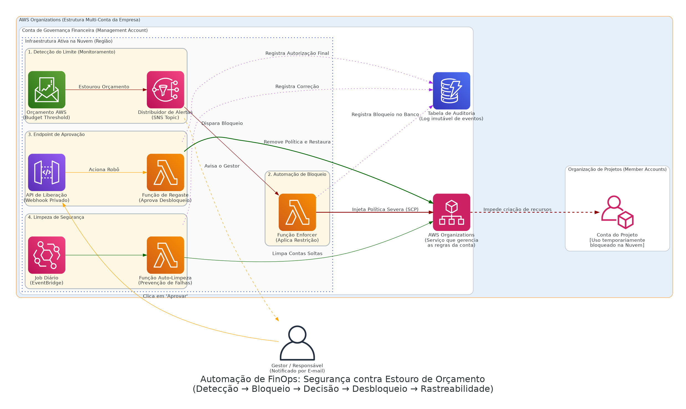

# FinOps Budget Enforcement with SCP

> **Detecção → Bloqueio → Decisão → Desbloqueio → Rastreabilidade**

## Arquitetura da Solução

O desenho visual do projeto modelado e versionado como código (Diagrams in Python):

  

## Contexto de Negócio & Problema

O time financeiro sofria com visibilidade tardia: contas de projeto (Sandbox) e prototipação na AWS frequentemente estouravam seus orçamentos sem nenhum controle restrito (*hard kill switch*). Quando o alerta diário/semanal de cobrança soava, dezenas de instâncias ou requisições desnecessárias já haviam consumido a quota mensal. 

Essa arquitetura propõe resolver o problema raiz substituindo avisos assíncronos por **Enforcement Direto (Service Control Policies - SCP)**. Ao se atingir o limiar (ex: 100% de uso), todos os serviços não restritos são limados de criar novos custos instantaneamente, bloqueando a falha arquitetural ou humana.

## Decisões Arquiteturais e Trade-offs

> [!NOTE] 
> **Service Control Policies vs IAM Roles Restritivas:**
> Escalar IAM local por conta (Member Account) é ineficiente em escala corporativa. Integrando a automação na conta `Management` do ecossistema *AWS Organizations*, injetamos a política raiz via SCP, garantindo que nem mesmo os super-roles da conta local consigam ultrapassar a barreira financeira.

> [!WARNING] 
> **Perigo de Interrupção Genuína de Serviço:**
> A imposição de SCP imediata pode corromper fluxos (ex: instâncias falhando salvamento em Database por Action denied). Devido a isso, a arquitetura provém a rota de **Workflow de Liberação (Desbloqueio)** ancorada no *API Gateway*, permitindo que o gestor clique no aviso enviado por e-mail e desbloqueie a conta sob demanda caso aceite o risco.

## Fluxo Principal (Step-by-Step)

1. Funcionalidade central de orçamentos (**AWS Budgets**) detecta a superação do threshold e empurra uma mensagem para o **Amazon SNS**.
2. O **SNS** ativa simultaneamente o **Gestor Financeiro** (via e-mail formatado) e a função automática, batizada de **Enforcer (AWS Lambda)**.
3. O modelo embutido na Lambda invoca o plano de contingência e escreve a restrição no log perpétuo do **DynamoDB**.
4. Sem intervenção humana, a **AWS Organizations** empurra a Service Control Policy bloqueando instantaneamente a member account afetada contra subidas de infraestrutura pagas (`RunInstances`, etc).
5. O gestor pode autorizar expansão da verba ou aceitar a quebra, usando o payload com webhook acionado por **AWS API Gateway** para derrubar a barreira via rotina secundária de lambda handler.

## Next Steps & Melhorias Constantes
- **IA e Anomalias:** Integrar fluxos de Cost Anomaly Detection para evitar picos abruptos em horas invés de aguardar ciclos de faturamento da matriz.
