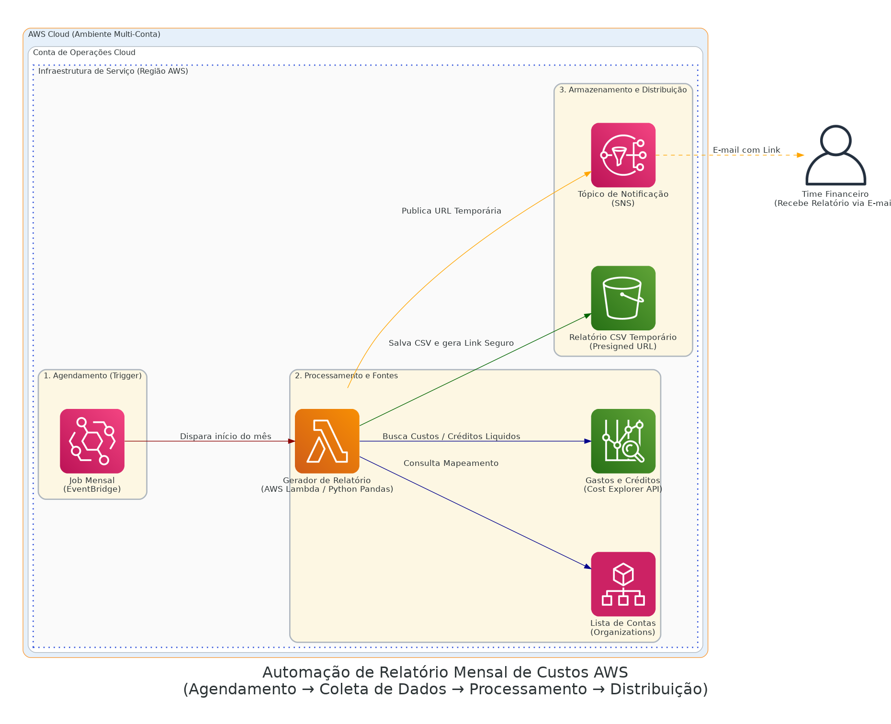

# Automatização de Cost Explorer & Report Mensal

> **Todo mês a automação coleta custos e créditos por conta, gera um CSV e envia o link automaticamente para quem precisa acompanhar sem overhead de engenharia.**

## Arquitetura da Solução

O desenho visual do pipeline financeiro estruturado:

  

## Contexto de Negócio & Problema

O time de operações da AWS precisava oferecer visibilidade contínua dos custos subdivididos para áreas financeiras desprovidas de acessos ao console da AWS, ou de conhecimento técnico para montar Queries no Athena/Cost Explorer. A rotina manual exigia acesso humano para exportar, organizar e enviar dados todo dia primeiro.

## Decisões Arquiteturais e Trade-offs

> [!NOTE] 
> **Isolamento via Presigned URLs:**
> Emitir o relatório para o S3 é prático, e para evitar que a base ficasse pública acionamos *Presigned URLs*. O executivo clica no link e obtém a planilha CSV formatadíssima válida pelas horas subsequentes, protegendo informações financeiras da empresa de forma natural.

> [!WARNING] 
> **Atraso de Consolidação de Custo:**
> Como *Trade-off* escolhido perante velocidade x precisão: o serviço AWS Cost Explorer API não entrega relatórios de precisão contábil do mês imediatamente nos primeiros minutos, há defasagem residual nativa. O agendamento da Lambda aguarda um pool temporal seguro ou adverte no CSV o carimbo de tempo da consolidação.

## Fluxo Principal (Step-by-Step)

1. A virada do relógio aciona uma regra temporal no **Amazon EventBridge**.
2. A **AWS Lambda** (encampada com a engine do Pandas Python) acorda em Cold Start, processando o tempo transcorrido no fechamento anterior.
3. Listas orgânicas da estrutura de Nuvem são validadas na **AWS Organizations** e o cruzamento dos limiares são absorvidos da **Cost Explorer API**.
4. O dataframe é compilado em disco efêmero (`/tmp`) da AWS Lambda antes de ser persistido a longo prazo num **S3 Bucket**.
5. O link expiráveis é forçado via SDK Python e depositado no **Amazon SNS**, o qual roteia a URL limpa para o gerente da conta ou caixa de contabilidade corporativa.

## Next Steps & Melhorias Constantes
- **Camada HTML via QuickSight:** Eliminar a dependência do arquivo estático (CSV) anexando a fonte da API diretamente a Dashboards AWS QuickSight para consumo online perene.
