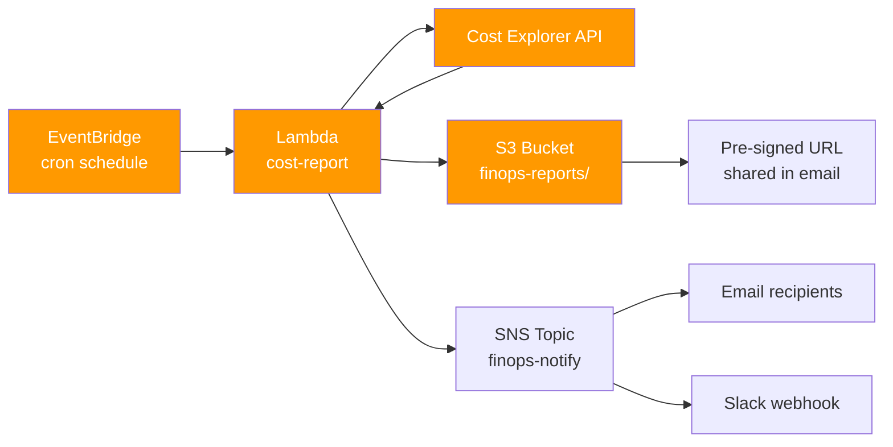

# 02 — Cost Report Automation

> Serverless pipeline that pulls AWS Cost Explorer data on a schedule, formats financial reports, and delivers them to stakeholders. Replaces manual monthly spreadsheets entirely.

[](https://aws.amazon.com)
[](https://python.org)
[](https://aws.amazon.com/lambda)

---

## 🎯 The Problem

Every month, somebody on the FinOps / engineering team manually:
1. Logs into AWS Cost Explorer
2. Sets the right date range and granularity
3. Filters by linked account, service, tag
4. Exports as CSV
5. Pastes into a spreadsheet
6. Sends to stakeholders

This is 2–6 hours of manual work per cycle. It's error-prone, inconsistent across months, and the bus-factor is one.

---

## 💡 The Solution

A scheduled serverless pipeline that does all of the above automatically: pulls cost data from the API, formats it into a clean report (CSV + chart), uploads to S3, and notifies stakeholders.

**Frequency:** configurable — daily, weekly, monthly.
**Granularity:** by account, by service, by tag (e.g., `cost-center`, `project`).
**Output:** CSV + optional HTML dashboard + email summary.

---

## 🏗️ Architecture



---

## ⚙️ Stack

| Layer | Service |
|-------|---------|
| Scheduler | Amazon EventBridge |
| Compute | AWS Lambda (Python 3.11) |
| Data source | AWS Cost Explorer API |
| Storage | Amazon S3 |
| Notification | Amazon SNS |
| Reporting libs | `pandas`, `boto3`, `matplotlib` (optional) |
| IaC | Terraform |

---

## 📂 Repo Layout

```
02-cost-report-automation/
├── README.md
├── terraform/
│   ├── main.tf
│   ├── variables.tf
│   ├── eventbridge.tf       # cron triggers
│   ├── lambda.tf            # function + IAM
│   ├── s3.tf                # report bucket
│   └── sns.tf               # notification topic
├── lambda/
│   ├── handler.py           # entrypoint
│   ├── cost_explorer.py     # API client + queries
│   ├── report_builder.py    # CSV / HTML formatting
│   ├── s3_uploader.py
│   ├── requirements.txt
│   └── tests/
└── docs/
    └── sample_report.html
```

---

## 💻 Implementation Highlights

### Cost Explorer query (excerpt)

```python
import boto3
from datetime import datetime, timedelta

ce = boto3.client("ce")

def get_cost_by_account(start_date: str, end_date: str):
    response = ce.get_cost_and_usage(
        TimePeriod={"Start": start_date, "End": end_date},
        Granularity="MONTHLY",
        Metrics=["UnblendedCost"],
        GroupBy=[
            {"Type": "DIMENSION", "Key": "LINKED_ACCOUNT"},
            {"Type": "TAG", "Key": "cost-center"},
        ],
    )
    return response["ResultsByTime"]
```

### Lambda handler (excerpt)

```python
import json
import os
from cost_explorer import get_cost_by_account
from report_builder import build_csv
from s3_uploader import upload_and_sign

def lambda_handler(event, context):
    start, end = compute_period()
    data = get_cost_by_account(start, end)
    csv_path = build_csv(data, period=f"{start}_{end}")
    signed_url = upload_and_sign(csv_path, expires_in=86400)

    notify_stakeholders(
        subject=f"FinOps weekly report — {start} to {end}",
        body=f"Download: {signed_url}",
    )
    return {"statusCode": 200, "report_url": signed_url}
```

### Terraform (excerpt)

```hcl
resource "aws_cloudwatch_event_rule" "weekly_report" {
  name                = "finops-weekly-report"
  schedule_expression = "cron(0 9 ? * MON *)"  # every Monday 9am UTC
}

resource "aws_cloudwatch_event_target" "trigger_lambda" {
  rule = aws_cloudwatch_event_rule.weekly_report.name
  arn  = aws_lambda_function.cost_report.arn
}
```

---

## ✅ Results

- ⏱️ **Manual hours eliminated:** ~4 hours/month → 0
- 🔁 **Cadence improved:** monthly → weekly (because it's free now)
- 📊 **Consistency:** same metrics, same period boundaries, same format every time
- 🔐 **Access control:** pre-signed S3 URLs expire in 24h; no public bucket
- 🔌 **Composable:** report format is JSON-first; trivial to swap CSV for HTML/PDF/Slack-card

---

## 🚀 How to Deploy

```bash
cd terraform/
terraform init
terraform apply -var-file=production.tfvars
```

Requirements:
- AWS account with Cost Explorer API enabled (free to enable, ~24h delay first time)
- Terraform 1.5+
- Lambda IAM role with `ce:GetCostAndUsage`, `s3:PutObject`, `sns:Publish`

---

## 📚 Related

- [01 — FinOps Budget Enforcement](../01-finops-budget-enforcement) — pairs naturally: visibility (this) + enforcement (that)
- [03 — Sophos Reconciliation](../03-sophos-reconciliation) — same serverless pattern, different data source

---

**Author:** Felipe de Lima Rosa · [LinkedIn](https://www.linkedin.com/in/felipe-limarosa) · [GitHub](https://github.com/felipefefeu)
