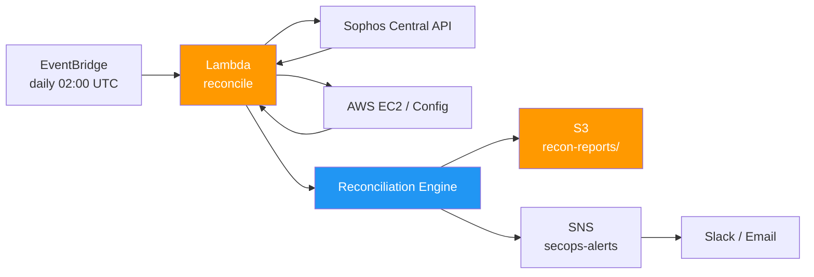

# 03 — Sophos × AWS Reconciliation Pipeline

> Daily reconciliation between Sophos endpoint inventory and AWS asset inventory. Detects gaps that indicate untracked endpoints, missing protection, or compliance drift.

[](https://aws.amazon.com)
[](https://python.org)
[](https://developer.sophos.com)

---

## 🎯 The Problem

In a mid-size org, endpoint protection (Sophos) and cloud inventory (AWS Config / EC2) drift apart constantly:

- New EC2 instances spun up without the Sophos agent installed
- Decommissioned servers still showing up in Sophos as "stale"
- Tags inconsistent between systems
- Compliance audits failing because of these gaps

Manually reconciling these inventories is repetitive, slow, and gets skipped under pressure — which is exactly when gaps appear.

---

## 💡 The Solution

A scheduled Lambda that:
1. Pulls the full endpoint list from the Sophos Central API
2. Pulls the active asset inventory from AWS (EC2 + Config)
3. Reconciles by hostname / IP / tag
4. Emits 3 lists:
   - **In AWS but not Sophos** (assets without protection — action needed)
   - **In Sophos but not AWS** (stale — to decommission)
   - **In both, but tags mismatch** (governance hygiene)
5. Posts to S3 + notifies SecOps via SNS / Slack

Runs daily. SecOps sees a delta report every morning instead of a 4-hour quarterly audit.

---

## 🏗️ Architecture



---

## ⚙️ Stack

| Layer | Service / Lib |
|-------|---------------|
| Scheduler | Amazon EventBridge |
| Compute | AWS Lambda (Python 3.11) |
| Source A | Sophos Central REST API |
| Source B | AWS EC2 + AWS Config |
| Storage | Amazon S3 |
| Notification | Amazon SNS |
| Secrets | AWS Secrets Manager (Sophos API key) |
| HTTP client | `requests` |

---

## 📂 Repo Layout

```
03-sophos-reconciliation/
├── README.md
├── terraform/
│   ├── main.tf
│   ├── lambda.tf
│   ├── secrets.tf            # Sophos API credential
│   └── eventbridge.tf
├── lambda/
│   ├── handler.py
│   ├── sophos_client.py      # Sophos Central API client
│   ├── aws_inventory.py      # EC2 + Config reader
│   ├── reconciler.py         # diff engine
│   ├── reports.py            # output formatter
│   └── requirements.txt
└── docs/
    └── sample_delta_report.md
```

---

## 💻 Implementation Highlights

### Sophos client (excerpt)

```python
import os
import requests
from typing import List, Dict

class SophosClient:
    def __init__(self, api_token: str, tenant_id: str):
        self.session = requests.Session()
        self.session.headers.update({
            "Authorization": f"Bearer {api_token}",
            "X-Tenant-ID": tenant_id,
        })
        self.base_url = "https://api.central.sophos.com"

    def list_endpoints(self) -> List[Dict]:
        endpoints = []
        url = f"{self.base_url}/endpoint/v1/endpoints"
        while url:
            r = self.session.get(url, timeout=30)
            r.raise_for_status()
            payload = r.json()
            endpoints.extend(payload.get("items", []))
            url = payload.get("pages", {}).get("nextKey")
        return endpoints
```

### Reconciliation logic (excerpt)

```python
def reconcile(sophos_assets: list, aws_assets: list) -> dict:
    sophos_by_host = {a["hostname"].lower(): a for a in sophos_assets}
    aws_by_host    = {a["PrivateDnsName"].split(".")[0].lower(): a for a in aws_assets}

    sophos_only = sophos_by_host.keys() - aws_by_host.keys()
    aws_only    = aws_by_host.keys() - sophos_by_host.keys()
    in_both     = sophos_by_host.keys() & aws_by_host.keys()

    tag_mismatches = [
        h for h in in_both
        if sophos_by_host[h].get("tags") != aws_by_host[h].get("Tags")
    ]

    return {
        "missing_protection": list(aws_only),       # IN AWS, NOT IN SOPHOS
        "stale_endpoints":    list(sophos_only),    # IN SOPHOS, NOT IN AWS
        "tag_drift":          tag_mismatches,
    }
```

---

## ✅ Results

- 🔁 **From quarterly to daily** visibility on endpoint protection gaps
- 🛡️ **Compliance posture** improved (audit-ready delta reports archived in S3)
- ⏱️ **Manual time eliminated:** ~4h/quarter → 0
- 🔐 **API credential security:** stored in Secrets Manager, rotated quarterly
- 📦 **Pattern reusable:** the diff engine is data-source-agnostic — can plug in CrowdStrike, Defender, etc.

---

## 🚀 How to Deploy

```bash
# 1. Store Sophos API credentials in Secrets Manager
aws secretsmanager create-secret \
  --name sophos/api-token \
  --secret-string '{"token":"...","tenant":"..."}'

# 2. Deploy infrastructure
cd terraform/
terraform init
terraform apply
```

Requirements:
- Sophos Central API access (Admin role)
- AWS Config enabled in target accounts
- Terraform 1.5+

---

## 📚 Related

- [01 — FinOps Budget Enforcement](../01-finops-budget-enforcement) — same multi-account scope, different governance axis
- [05 — Secure Data Ingestion](../05-secure-data-ingestion) — pairs with this for full security-posture coverage

---

**Author:** Felipe de Lima Rosa · [LinkedIn](https://www.linkedin.com/in/felipe-limarosa) · [GitHub](https://github.com/felipefefeu)
