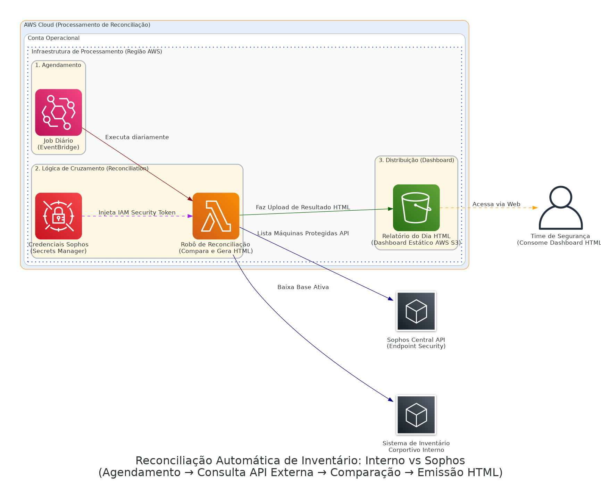

# Sophos Endpoint Inventory Reconciliation

> **Verificação contínua e imutável descobrindo lacunas de segurança (Máquinas vivas na nuvem x Instalação Oficial do Agente Endpoint).**

## Arquitetura da Solução

O desenho visual do pipeline seguro:

  

## Contexto de Negócio & Problema

Com a vasta quantidade de instâncias sendo ligadas diariamente, o CISO (Chief Information Security Officer) estava sob o medo constante do abandono de ativos corporativos operando online *sem* conectividade e as licenças providenciadas do agente Sophos. Auditoria manual dependia de buscar linhas falhas em duas planilhas soltas. 

Foi criada essa autêntica pipeline de higienização cibernética, comparando e cruzando inventários (o que possuía o agente vs instâncias ativas inventariadas) alertando de forma determinística os *Gaps* nas políticas de endpoint zero-trust.

## Decisões Arquiteturais e Trade-offs

> [!NOTE] 
> **Adoção do Secrets Manager:**
> Chaves diretas da API da Sophos ou inventários on-premise são um dos vetores de vazamento perigosíssimos em lambdas sujas. O uso nativo do **AWS Secrets Manager**, com as credenciais sendo obtidas virtualmente do espaço restrito garante criptografia estrita.

> [!WARNING] 
> **Limites de API e Paginação:**
> A escalabilidade desse software exige contenção. APIs legadas costumam ter limites brutos de concorrência ou paginação não linear de lista de máquinas. A Lambda foi parametrizada para executar chamadas por blocos mitigando estouros restritivos da própria provedora do software de detecção de vírus.

## Fluxo Principal (Step-by-Step)

1. Disparo de rotina noturna injetado via **EventBridge** no coração da computação elástica.
2. Com privilégios providenciados, a **Lambda** extraí as credenciais criptografadas de leitura da Sophos a partir de seus contêineres IAM.
3. Download cruzado dos mapeamentos de inventários (Externa via Endpoint Rest da Sophos, e Interna).
4. O bloco em Python implementa agrupamentos de *Set() e Dict()* validando 4 categorias de risco: Saudáveis / Isoladas Internamente / Ausentes na Segurança / Lixo Eletrônico.
5. Os arrays são moldados numa tabela dinâmica (Template Web / HTML).
6. Upload atômico para o S3 de Gestão servindo um FrontEnd em nuvem estática diretamente para a tela de monitoramento corporativa das Áreas de Incident Response Team.

## Next Steps & Melhorias Constantes
- **Automação Punitiva (Isolação de Subnets):** Aplicar *Enforcement* nos IPs listados em vermelho movendo-os em tempo real a *Security Groups Isolados* em quarentena até receberem seus softwares nativos instalados.
