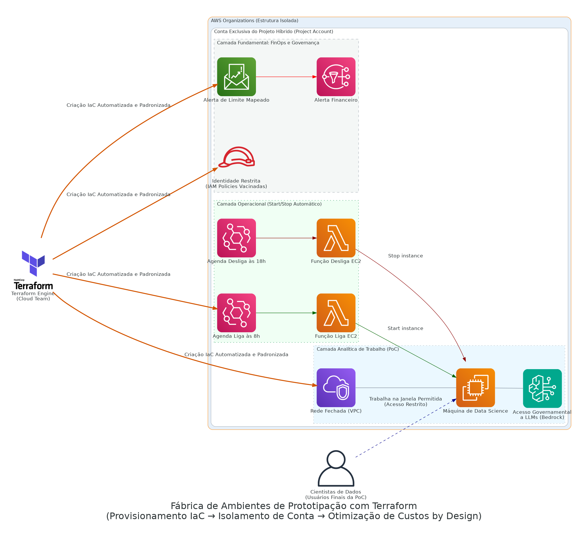

# Terraform-Based Environment PoC Factory

> **Injeção de padronização corporativa e FinOps by Design para times de AI gerando ambientes na AWS.**

## Arquitetura da Solução

O isolamento e esteiras contruídas no Terraform (Architecture Flow):

  

## Contexto de Negócio & Problema

Com o advento acelerado de LLMs nativas do `Amazon Bedrock`, cientistas de dados começaram a pedir inúmeros ambientes de sandbox criados e apagados no modo Console/Point-and-Click. Isso resulta no vício generalizado em *AWS Secret Keys*, criação de instâncias monstro esquecidas durante o fim de semana (desperdício colossal), e acesso a internet pública onde não há controle.

Tivemos o compromisso de barrar o Wild West ("faroeste") mudando de uma alocação Ad-hoc de componentes para uma "Terraform Factory". Ambientes inteiros englobando Nuvem e Segurança só saem do papel após os arquivos de configuração serem engatilhados como Infra as Code.

## Decisões Arquiteturais e Trade-offs

> [!NOTE] 
> **Schedule Stop vs Flexibilidade de Produção:**
> Toda VM da fábrica nasce blindada com scripts no EventBridge forçando o "Stop" fora do expediente (Ato clássico de Otimização de Cutso em Workload Sandbox). Entendemos que protótipos de ciência de dados não são produtos Full Time. 

> [!WARNING] 
> **Contas Independentes por Cliente vs VPC Isolada:**
> Para conter as permissões em ambientes isolados, evitamos isolamento lógico por VPC em conta suja e focamos no "Account Per PoC Boundaries". Isolando não há misturas no faturamento (o AWS Budgets opera no isolamento microscópico de conta) - exigindo maior orquestração, porém menor risco de quebras de sigilo entre PoCs.

## Fluxo Principal (Step-by-Step)

1. Validação de credenciais organizacionais pela infraestrutura central Cloud.
2. Injetor Automático atua compilando estado (State) do repositório da nuvem AWS.
3. Alvo restrito (*Project Account*) gera isolamento orçamentário injetando `AWS Budgets` associado a alertas de redes sociais corporativas / E-mail no SNS.
4. Escavação de malha Privada VPC (Subnets, NatGateway/SG) restritas evitando trânsito em HTTP padrão se não devidamente tunelado.
5. Ingestão da autorização local dos papeis (IAM Restrito sem criação genérica de Admin global).
6. Execução final levantando a frota de Cientistas (EC2 Base e acesso de porta modelar aos LLM AWS Bedrock API).

## Next Steps & Melhorias Constantes
- **Self-Service Portal (Internal Developer Platform):** Acoplar a execução do terraform em um front-end no estilo Backstage, onde os próprios cientistas consigam com um clique ligar essa esteira, mantendo ainda a segurança 100% controlada pelos guardrails da TI.
