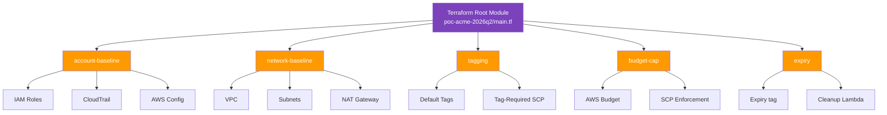

# 04 — Terraform PoC Factory

> Standardized, governed AWS account/environment provisioning via Terraform modules. Every new PoC, sandbox, or experiment ships with guardrails baked in — IAM, tagging, budget caps, network isolation — from minute zero.

[](https://terraform.io)
[](https://aws.amazon.com)
[](https://terraform.io)

---

## 🎯 The Problem

Every new PoC requires:
- A new (or shared) AWS account
- Baseline IAM roles, policies, MFA enforcement
- VPC with subnets, route tables, IGW/NAT
- Standard tagging (`cost-center`, `project`, `owner`, `expiry`)
- Budget cap with auto-enforcement
- Logging (CloudTrail, Config) enabled

Done manually, each PoC takes **half a day to bootstrap** and inevitably skips one of these steps. Skipped steps become incidents later: untagged resources, over-permissioned roles, no cost ownership.

---

## 💡 The Solution

A composable Terraform module library that, in one `terraform apply`, provisions a fully governed environment. **30 seconds vs. half a day.**

Modules included:
- `account-baseline` — IAM, CloudTrail, Config
- `network-baseline` — VPC, subnets, NAT (optional)
- `tagging` — standard tag enforcement via SCP
- `budget-cap` — AWS Budget with SCP enforcement (integrates with [Project 01](../01-finops-budget-enforcement))
- `expiry` — auto-tag with TTL for cleanup automation

Each PoC is a thin root module that picks the components it needs.

---

## 🏗️ Architecture



---

## ⚙️ Stack

| Layer | Tool |
|-------|------|
| IaC | Terraform 1.5+ |
| Provider | AWS (multi-region) |
| State | S3 backend + DynamoDB lock |
| Modules | Composable, versioned, semver-tagged |
| Validation | `tflint`, `terraform validate`, `checkov` (in CI) |
| Cost preview | `infracost` (in CI) |

---

## 📂 Repo Layout

```
04-terraform-poc-factory/
├── README.md
├── modules/
│   ├── account-baseline/
│   │   ├── main.tf
│   │   ├── variables.tf
│   │   ├── iam.tf
│   │   ├── cloudtrail.tf
│   │   └── config.tf
│   ├── network-baseline/
│   ├── tagging/
│   ├── budget-cap/
│   └── expiry/
├── examples/
│   ├── poc-minimal/         # only account-baseline + tagging
│   ├── poc-with-network/    # adds VPC + NAT
│   └── poc-full/            # all modules
└── docs/
    └── module-catalog.md
```

---

## 💻 Implementation Highlights

### Example root module (excerpt)

```hcl
terraform {
  required_version = ">= 1.5"
  backend "s3" {
    bucket         = "tf-state-pocs"
    key            = "poc-acme-2026q2/terraform.tfstate"
    region         = "us-east-1"
    dynamodb_table = "tf-locks"
  }
}

locals {
  default_tags = {
    cost-center = "rd"
    project     = "acme-poc"
    owner       = "felipe@a3data"
    expiry      = "2026-07-01"
  }
}

provider "aws" {
  default_tags { tags = local.default_tags }
}

module "account_baseline" {
  source = "../../modules/account-baseline"
}

module "network" {
  source             = "../../modules/network-baseline"
  cidr_block         = "10.42.0.0/16"
  enable_nat_gateway = false  # cheap PoC
}

module "tagging" {
  source         = "../../modules/tagging"
  required_tags  = ["cost-center", "project", "owner", "expiry"]
}

module "budget" {
  source       = "../../modules/budget-cap"
  budget_limit = 200   # USD
  threshold    = 80
}
```

### Tag-required SCP (excerpt)

```json
{
  "Version": "2012-10-17",
  "Statement": [
    {
      "Sid": "DenyUntaggedResourceCreation",
      "Effect": "Deny",
      "Action": ["ec2:RunInstances", "rds:CreateDBInstance"],
      "Resource": "*",
      "Condition": {
        "Null": {
          "aws:RequestTag/cost-center": "true"
        }
      }
    }
  ]
}
```

---

## ✅ Results

- ⚡ **From half-a-day to 30 seconds** to bootstrap a governed PoC environment
- 🏷️ **Tag coverage: 100%** — enforced at API level, not just policy doc
- 💰 **Cost cap: 100%** — every PoC has a budget cap from minute zero
- 🔁 **Composable:** team picks the modules they need; minimal config for minimal PoC, full for production-readiness PoC
- 📈 **Standardization:** every account looks the same — debugging, audit, handoffs become trivial

---

## 🚀 How to Use

```bash
# Bootstrap a new PoC
cp -r examples/poc-minimal poc-acme-2026q2
cd poc-acme-2026q2

# Edit tags + budget in main.tf
$EDITOR main.tf

terraform init
terraform plan
terraform apply
```

Requirements:
- Terraform 1.5+
- AWS account in an Organization (for SCP application)
- S3 + DynamoDB for state (or adjust backend)

---

## 📚 Related

- [01 — FinOps Budget Enforcement](../01-finops-budget-enforcement) — `budget-cap` module pairs with this
- [06 — VPN Connectivity](../06-vpn-connectivity) — `network-baseline` extends naturally for connected PoCs

---

**Author:** Felipe de Lima Rosa · [LinkedIn](https://www.linkedin.com/in/felipe-limarosa) · [GitHub](https://github.com/felipefefeu)
