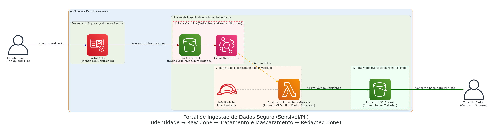

# Secure PII Data Ingestion Portal 

> **Zonas de quarentena baseadas em Identity protegendo o coração analítico contra contaminação por vazamento de dados sensíveis na nuvem.**

## Arquitetura da Solução

O esquema rigoroso de zonas frias (Raw e Redact) entre o front-end aberto e a matriz restrita corporativa:

  

## Contexto de Negócio & Problema

Projetos Proof of Concepts (PoCs) precisavam das bases "reais" do próprio cliente como adubo e validação técnica das tecnologias fornecidas. Frequentemente clientes despreparados geram uploads na infraestrutura dos portais parceiros despachando colunas lotadas de Informações Pessoais Identificáveis (PII - CPFs, Renda, Nomes Reais). Isso viola preceitos profundos da Lei Geral de Proteção de Dados de trânsito inseguro e visibilidade restrita.

## Decisões Arquiteturais e Trade-offs

> [!NOTE] 
> **Uso do Cognito em vez de Usuário IAM Tradicional:**
> Não é seguro e nem escalável abrir credenciais AWS (Access Keys) em nuvem para clientes externos da companhia inteira realizarem FTP rudimentar. O sistema é baseado no portal moderno integrado a tokens cognitivos, restringindo puramente sessões aos IDs federados sem tocar a base de segurança (IAM) em momento de borda.

> [!WARNING] 
> **Divisão Red/Green Cloud Buckets Zone:**
> O S3 principal de upload age só e apenas como uma Caixa Preta (Red/Raw Bucket) criptografada com chaves limitadas KMS. Cientistas estão proibidos nativamente nas Access Policies de abri-la. 

## Fluxo Principal (Step-by-Step)

1. Usuário/Cliente efetua o Sign-In nas políticas abertas do front-end interagindo com a base protegida **Amazon Cognito**.
2. A recepção valida e permite o depósito em bloco em via criptografada para caixas temporárias restritas.
3. Os dados quentes colidindo no bucket "Zona Fria / Raw S3 Bucket" causam impacto detectado por gatilhos.
4. Uma camada oculta processadora (**Pipeline Lambda de Redaction Computacional**) isola o dataset bruto de forma nativa e sem intervenção gerencial.
5. Algoritmos dissecam, processam, limitam as colunas, aplicam tokens ou hashes sobre máscaras de CPFs.
6. A base 100% higienizada e livre de preocupações regulatórias finalmente flui para o **S3 Redacted Bucket** liberando o trânsito da IA do time interno no material original censurado.

## Next Steps & Melhorias Constantes
- **Integrar Macie:** Utilizar o Machine Learning focado em Governança do *Amazon Macie* monitorando o repositório restrito continuamente à procura de qualquer anomalia criptográfica de dados PII vazados que pudessem escapar à varredura clássica.
