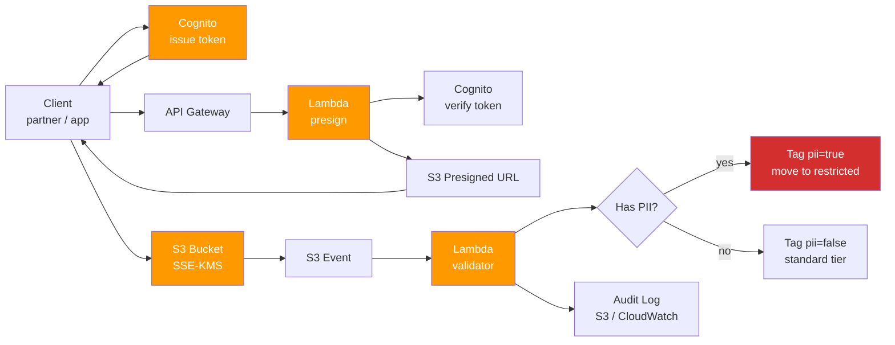

# 05 — Secure Data Ingestion with PII Protection

> Authenticated drop zone for PII-bearing data. Uses **Cognito + S3 + Lambda + KMS** to enforce identity-aware ingestion, server-side encryption, validation, and PII tagging — without writing identity code from scratch.

[](https://aws.amazon.com)
[](https://python.org)
[](https://aws.amazon.com/compliance/data-protection/)

---

## 🎯 The Problem

A typical "drop your data here" S3 bucket is one of the most common security incidents in cloud:
- Open buckets indexed by Shodan
- Files dropped without encryption-at-rest
- No identity behind uploads (can't audit who sent what)
- PII mixed with non-PII (over-broad blast radius if leak)
- No validation — bad data poisons downstream pipelines

The fix isn't more controls layered on top. It's an **identity-aware, validated, segmented** ingestion pattern.

---

## 💡 The Solution

A 4-component ingestion stack:
1. **Cognito** — issues identity tokens to authenticated users / partner systems
2. **API Gateway + Lambda (auth)** — exchanges Cognito token for a **pre-signed S3 PUT URL**, scoped to a path that includes the user's identity
3. **S3** — receives the file at a path like `s3://bucket/uploads/${cognito-sub}/${date}/${filename}` with SSE-KMS encryption
4. **Lambda (validator)** — triggered on object created; validates schema, scans for PII patterns, applies tags (`pii=true`, `classification=restricted`), moves to encrypted tier or rejects

No human ever has direct write access to the bucket. Every upload is authenticated, encrypted, validated, and tagged.

---

## 🏗️ Architecture



---

## ⚙️ Stack

| Layer | Service |
|-------|---------|
| Identity | Amazon Cognito User Pool |
| API | Amazon API Gateway (REST) |
| Compute | AWS Lambda (Python 3.11) |
| Storage | Amazon S3 (SSE-KMS) |
| Encryption | AWS KMS (customer-managed key) |
| Validation libs | `presidio`, `python-magic`, custom schema |
| Audit | CloudWatch Logs + S3 access logs |
| IaC | Terraform |

---

## 📂 Repo Layout

```
05-secure-data-ingestion/
├── README.md
├── terraform/
│   ├── main.tf
│   ├── cognito.tf
│   ├── api_gateway.tf
│   ├── s3.tf
│   ├── kms.tf
│   └── lambda.tf
├── lambda/
│   ├── presign/
│   │   ├── handler.py
│   │   └── requirements.txt
│   ├── validator/
│   │   ├── handler.py
│   │   ├── pii_detector.py    # uses presidio / regex
│   │   ├── schema_validator.py
│   │   └── requirements.txt
│   └── shared/
│       └── audit.py
└── docs/
    └── threat-model.md
```

---

## 💻 Implementation Highlights

### Lambda — presign endpoint (excerpt)

```python
import os
import boto3
from datetime import datetime

s3 = boto3.client("s3")
BUCKET = os.environ["INGESTION_BUCKET"]

def lambda_handler(event, context):
    claims = event["requestContext"]["authorizer"]["jwt"]["claims"]
    user_sub = claims["sub"]
    date = datetime.utcnow().strftime("%Y-%m-%d")
    filename = event["queryStringParameters"]["filename"]

    key = f"uploads/{user_sub}/{date}/{filename}"

    url = s3.generate_presigned_url(
        "put_object",
        Params={
            "Bucket": BUCKET,
            "Key": key,
            "ServerSideEncryption": "aws:kms",
            "SSEKMSKeyId": os.environ["KMS_KEY_ID"],
        },
        ExpiresIn=900,  # 15 minutes
    )
    return {"statusCode": 200, "body": json.dumps({"upload_url": url, "key": key})}
```

### Lambda — PII validator (excerpt)

```python
import boto3
from pii_detector import scan_for_pii

s3 = boto3.client("s3")

def lambda_handler(event, context):
    bucket = event["Records"][0]["s3"]["bucket"]["name"]
    key    = event["Records"][0]["s3"]["object"]["key"]

    obj = s3.get_object(Bucket=bucket, Key=key)
    body = obj["Body"].read().decode("utf-8", errors="ignore")

    pii_findings = scan_for_pii(body)

    tags = {
        "pii": "true" if pii_findings else "false",
        "classification": "restricted" if pii_findings else "internal",
        "validated_at": datetime.utcnow().isoformat(),
    }

    s3.put_object_tagging(
        Bucket=bucket, Key=key,
        Tagging={"TagSet": [{"Key": k, "Value": v} for k, v in tags.items()]}
    )

    if pii_findings:
        # Move to restricted bucket / partition
        move_to_restricted(bucket, key, findings=pii_findings)
```

### KMS key policy (excerpt)

```json
{
  "Version": "2012-10-17",
  "Statement": [
    {
      "Sid": "OnlyIngestionLambdaCanEncrypt",
      "Effect": "Allow",
      "Principal": { "AWS": "arn:aws:iam::ACCOUNT:role/lambda-presign" },
      "Action": ["kms:GenerateDataKey", "kms:Encrypt"],
      "Resource": "*"
    },
    {
      "Sid": "OnlyValidatorAndConsumersCanDecrypt",
      "Effect": "Allow",
      "Principal": { "AWS": [
        "arn:aws:iam::ACCOUNT:role/lambda-validator",
        "arn:aws:iam::ACCOUNT:role/data-consumer"
      ]},
      "Action": "kms:Decrypt",
      "Resource": "*"
    }
  ]
}
```

---

## ✅ Results

- 🔐 **Zero unauthenticated writes** — every object has a Cognito identity attached
- 🛡️ **Encryption-at-rest by default** — SSE-KMS with customer-managed key
- 🏷️ **PII auto-tagged** — downstream pipelines can filter by `classification`
- 📜 **Audit trail** — every upload logged with user, timestamp, validation result
- 🧱 **Blast radius reduced** — PII partitioned from non-PII

---

## 🚀 How to Deploy

```bash
cd terraform/
terraform init
terraform apply
```

Requirements:
- Cognito User Pool (or import existing)
- KMS permissions (account-level)
- Terraform 1.5+

---

## 📚 Related

- [03 — Sophos Reconciliation](../03-sophos-reconciliation) — pairs for full security posture
- [01 — FinOps Budget Enforcement](../01-finops-budget-enforcement) — same multi-account pattern

---

**Author:** Felipe de Lima Rosa · [LinkedIn](https://www.linkedin.com/in/felipe-limarosa) · [GitHub](https://github.com/felipefefeu)
