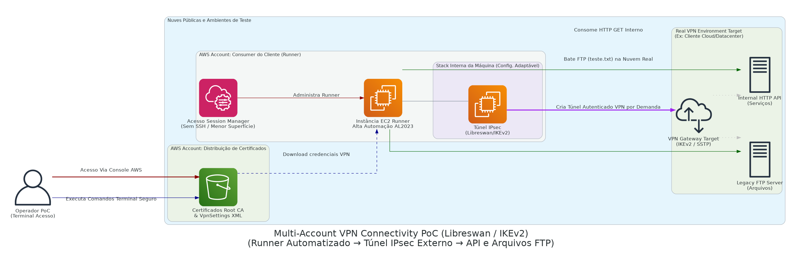

# Multi-Account Network / VPN Tunnel Validations

> **Engenharia fluida operando em protocolo IPsec Libreswan conectando e integrando nuvens legadas sem necessidade do perigoso acesso SSH na porta local.**

## Arquitetura da Solução

Desenho logístico real evidenciando os protocolos IPsec para acessar servidores antigos em Nuvem Fechada:

  

## Contexto de Negócio & Problema

Para integrar um produto externo de monitoria a um ecossistema corporativo antigo (Datacenter de Cliente ou Nuvem não moderna), a ponte necessitou testar e comprovar um túnel viável de ponta a ponta sem ferir a regra de ouro das companhias: "Proibido abrir máquinas via SSH nativa localmente (Security Guardrail)". O protocolo OpenVPN provou-se insuficiente para interagir nas exigentes APIs antigas Microsoft/Linux legadas via IKEv2.

A prova de conceito arquitetônica modelada por engenharia reversa foi construida usando componentes nativos Amazon Linux acionadas à distância via S3.

## Decisões Arquiteturais e Trade-offs

> [!NOTE] 
> **Fugindo da quebra de segurança de chaves (Morte do SSH):**
> A espinha dorsal da automação usa amplificado emprego do *AWS Systems Manager (SSM Session)*. Executar os códigos pesados localmente de conectividade e testar FTP, IPsec com StrongSwan ou IKE através de uma interface baseada em nuvem AWS isolada reduziu em escala absurda a superfície cibernética sob o olhar dos técnicos de Risco.

> [!WARNING] 
> **StrongSwan vs Libreswan e AMIs Nativas:**
> Inicialmente testado sob o pacote global comum, o ecossistema do recém imposto *Amazon Linux 2023* expôs não suportar repositórios do OpenVPN adaptativos. A decisão de engenharia local forçou adaptação manual pesada alterando inteiramente a engine final pelo `Libreswan`, integrando certificados manuais Microsoft e trânsito IPsec real, atestando versatilidade corporativa imensa do especialista local perante as documentações vazias da Internet global.

## Fluxo Principal (Step-by-Step)

1. A Conta Inicial injeta os componentes, incluindo certificados e as raízes da Root CA de nuvens vizinhas fechadas num pacote cego no Bucket da AWS S3.
2. Contêineres operacionais em nuvem, baseados em EC2 Runner na conta isolada assumem suas funções ativadas por Sessões via SSM, obtendo o upload.
3. Desencapsulamento de artefatos (.ovpn -> VpnSettings do túnel IKEv2), instalação do serviço Linux (Libreswan) em sub-rede local inativa externamente e iniciava túnel por demanda (`ipsec up`) validando roteamento e DNS envenenado interno em malha global paralela.
4. Conexões de validamento executavam *HTTP Get Scripts / FTP Data Transfer Scripts* down nos targets internos não mapeados cruzado ao mundo online, validando o enlace contínuo e caindo imediatamente ao fim, varrendo rastros e certificados da pasta de instalação com `awscli`.

## Next Steps & Melhorias Constantes
- **Transit Gateway (Para Produção Definitiva):** Transformar testes e PoCs em roteamento real conectando as malhas AWS utilizando as poderosas ligações permanentes de hardware com Customer Gateways interligados centralmente mediante Transit Gateway de roteamento BGP escalável nativo sem depender de Linux interno e Lambdas.
