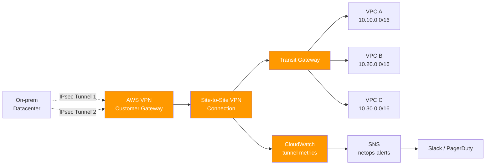

# 06 — Multi-Account VPN Connectivity

> IPsec site-to-site VPN between AWS accounts and on-prem datacenter, provisioned via Terraform with Transit Gateway, redundant tunnels, monitoring, and route automation.

[](https://aws.amazon.com)
[](https://terraform.io)
[](https://aws.amazon.com/vpn)

---

## 🎯 The Problem

Connecting multi-account AWS environments to on-prem (or to each other) reliably:
- Manual VPN setup is error-prone — wrong CIDRs, PSK typos, route table mistakes
- Single-tunnel deployments fail without warning
- Route propagation between Transit Gateway and VPCs needs to be consistent
- Monitoring tunnel health is often forgotten until something breaks at 3am

---

## 💡 The Solution

A reusable Terraform module that provisions:
- **Customer Gateway** — represents the on-prem peer
- **Site-to-Site VPN** with **2 redundant tunnels** (different availability zones)
- **Transit Gateway** attachment for fan-out routing
- **Route tables** — automatically propagated to attached VPCs
- **CloudWatch alarms** on tunnel status, packet drops, BGP state
- **SNS notification** when a tunnel goes down

One `terraform apply`, the connection is up. Monitoring included.

---

## 🏗️ Architecture



---

## ⚙️ Stack

| Layer | Service |
|-------|---------|
| VPN | AWS Site-to-Site VPN |
| Routing | AWS Transit Gateway |
| Endpoint | Customer Gateway |
| Monitoring | Amazon CloudWatch |
| Alerting | Amazon SNS |
| DNS resolution | Route 53 Resolver |
| IaC | Terraform |

---

## 📂 Repo Layout

```
06-vpn-connectivity/
├── README.md
├── terraform/
│   ├── main.tf
│   ├── customer_gateway.tf
│   ├── vpn_connection.tf
│   ├── transit_gateway.tf
│   ├── route_propagation.tf
│   ├── monitoring.tf
│   ├── variables.tf
│   └── outputs.tf
├── scripts/
│   ├── validate_tunnels.sh   # synthetic check
│   └── failover_test.sh      # planned-failover test
└── docs/
    ├── topology.png
    └── ipsec-parameters.md
```

---

## 💻 Implementation Highlights

### Customer Gateway + VPN (excerpt)

```hcl
resource "aws_customer_gateway" "main" {
  bgp_asn    = var.on_prem_bgp_asn
  ip_address = var.on_prem_public_ip
  type       = "ipsec.1"
  tags = {
    Name = "cgw-${var.environment}"
  }
}

resource "aws_vpn_connection" "main" {
  customer_gateway_id = aws_customer_gateway.main.id
  transit_gateway_id  = aws_ec2_transit_gateway.main.id
  type                = "ipsec.1"
  static_routes_only  = false  # use BGP

  tunnel1_inside_cidr   = "169.254.10.0/30"
  tunnel2_inside_cidr   = "169.254.20.0/30"
  tunnel1_preshared_key = var.tunnel1_psk
  tunnel2_preshared_key = var.tunnel2_psk

  tags = { Name = "vpn-${var.environment}" }
}
```

### CloudWatch alarms (excerpt)

```hcl
resource "aws_cloudwatch_metric_alarm" "tunnel_down" {
  count               = 2
  alarm_name          = "vpn-tunnel-${count.index + 1}-down-${var.environment}"
  metric_name         = "TunnelState"
  namespace           = "AWS/VPN"
  statistic           = "Maximum"
  period              = 60
  evaluation_periods  = 2
  threshold           = 0
  comparison_operator = "LessThanOrEqualToThreshold"
  alarm_actions       = [aws_sns_topic.netops.arn]
  dimensions = {
    VpnId       = aws_vpn_connection.main.id
    TunnelIpAddress = aws_vpn_connection.main[count.index == 0 ? "tunnel1_address" : "tunnel2_address"]
  }
}
```

### Route propagation to VPCs (excerpt)

```hcl
resource "aws_ec2_transit_gateway_route_table_association" "vpc" {
  for_each                       = toset(var.attached_vpc_ids)
  transit_gateway_attachment_id  = aws_ec2_transit_gateway_vpc_attachment.this[each.key].id
  transit_gateway_route_table_id = aws_ec2_transit_gateway_route_table.main.id
}
```

---

## ✅ Results

- 🔁 **Redundancy by default:** 2 tunnels, failover < 30s
- 🚨 **No silent failures:** CloudWatch + SNS catches tunnel drops in 60s
- 🏗️ **Reproducible:** any environment (dev/stg/prod) provisioned via same module
- 📊 **Observability:** tunnel state, packet drops, BGP advertisements all monitored
- 🔌 **Composable:** integrates with [Project 04 — Terraform PoC Factory](../04-terraform-poc-factory) network-baseline

---

## 🚀 How to Deploy

```bash
cd terraform/
# Edit variables (on-prem public IP, BGP ASN, environment)
$EDITOR terraform.tfvars

terraform init
terraform plan
terraform apply
```

Requirements:
- On-prem device supporting IPsec IKEv2
- Public IP on the on-prem side
- BGP-capable peer (recommended; can fall back to static routes)
- Terraform 1.5+

**After apply:** download the VPN configuration sample (`aws_vpn_connection.main.customer_gateway_configuration`) and feed it to your on-prem device.

---

## 📚 Related

- [04 — Terraform PoC Factory](../04-terraform-poc-factory) — provisions the VPCs this connects
- [01 — FinOps Budget Enforcement](../01-finops-budget-enforcement) — same multi-account governance pattern

---

**Author:** Felipe de Lima Rosa · [LinkedIn](https://www.linkedin.com/in/felipe-limarosa) · [GitHub](https://github.com/felipefefeu)
